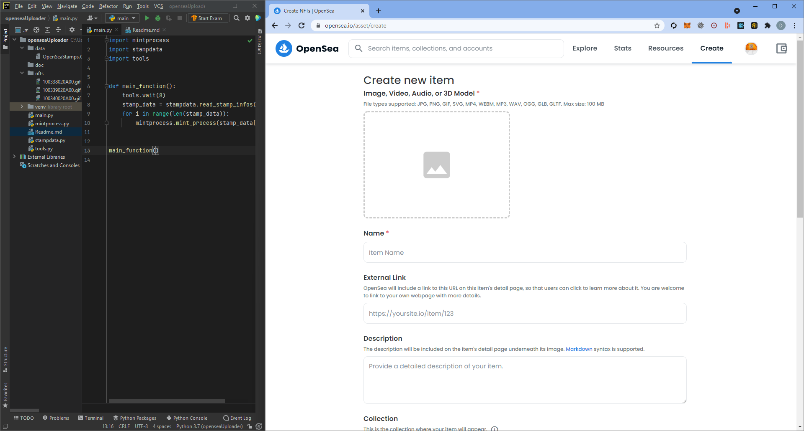
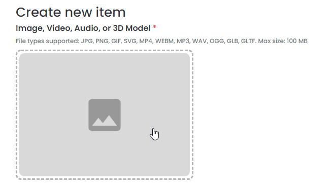
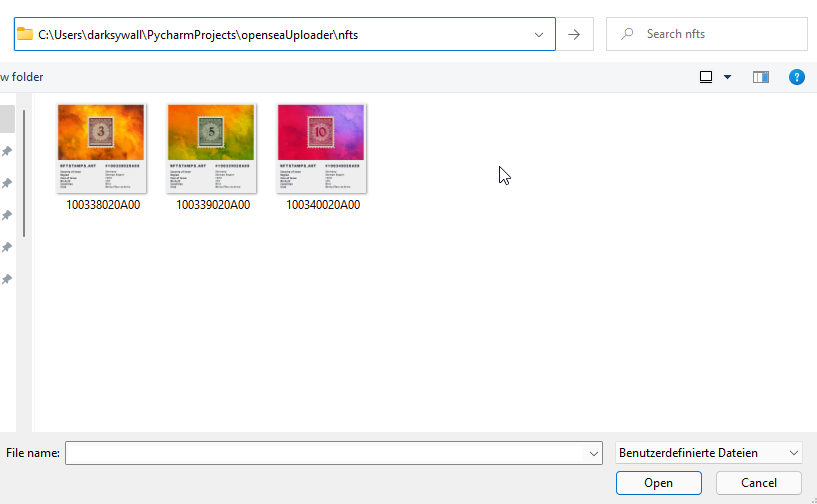

# opensea-nftcreator-makro

This is a python script for creating nfts on opensea via opensea.io website

### script-files:

- tools.py - marko scripts for interacting with keyboard / mouse
- stampdata.py - functions for loading csv file from data folder and returning it as a list
- mintprocess.py - describes the process of creating an nft in the browser (template - you need to modify)
- main.py - loads nft data from file and loops through each list element by executing mintprocess

### tools.py

Here are all available functions you can use in the mintprocess:

````python
import tools

tools.wait(12)  # waits 12 seconds before proceedinf
tools.press_tab(2)  # press 2x tab to switch between inputs / tabs
tools.press_reverse_tab(1)  # press 1x shift + tab to jump back one input
tools.press_f5(1)  # press 1x F5 to refresh browserpage
tools.press_return(1)  # press 1x return to press buttons on the page
tools.press_space(1)  # press 1x space button
tools.click(200, 100)  # do a mouse click on position x: 200, y: 100
tools.doubleclick(200, 100)  # do a doubleclick on position x: 200, y: 100
tools.paste_text("Hello World")  # copies the given text into RAM and paste it in the selected input box

# Only use this function in a separate application for constantly showing cursor position
# to evaluate which coordinates you need to implement in your code
tools.show_cursor_pos()  # endless loop - displays current cursor position in console
````

## How to use:

### 1. Preparation - System
- install git: https://git-scm.com/downloads
- install python: https://www.python.org/
- install pycharm community: https://www.jetbrains.com/de-de/pycharm/download/

### 2. Preparation - Pycharm:
- clone git repo
- add packages to your dev environment (pip):
  - pyperclip
  - pynput

### 3. Build up your CSV:
In my example, my csv header looks like this:
````csv
asset_title; external_url; description; unlockable; max_supply; property; value; image_name
````
I am using these in my stampdata.py file to address the fields to a human readable headline.
In the csv you need to remove the header so your file looks something like this:

````csv
My Asset;https://test.com/;This is the description of my asset;This is a top secret unlockable content;1000;Health;Healthy;my_nft_1244.jpg
My Asset;https://test.com/;This is the description of my asset;This is a top secret unlockable content;1000;Health;Healthy;my_nft_1244.jpg
My Asset;https://test.com/;This is the description of my asset;This is a top secret unlockable content;1000;Health;Healthy;my_nft_1244.jpg
My Asset;https://test.com/;This is the description of my asset;This is a top secret unlockable content;1000;Health;Healthy;my_nft_1244.jpg
My Asset;https://test.com/;This is the description of my asset;This is a top secret unlockable content;1000;Health;Healthy;my_nft_1244.jpg
````

You can insert any data in this csv file.
Everything you enter here, you will be able to paste this text via the macro function on the webpage<br>

Save the file under "/data/OpenSea.CSV" in the project dir, like the example file.

### 4. Prepare the Stampdata.py

In the following code snippet, you only need to adjust the values inside of "nft_data.append()"<br>
Here you need to add all your csv headers in order you inserted them in your csv<br>
In my case it looks something like this:

````python
import csv

def read_stamp_infos():
    nft_data = []

    with open('data/OpenSea.CSV', newline='') as csvfile:
        reader = csv.reader(csvfile, delimiter=';')
        for row in reader:
          
            # THIS IS THE INTERESTING PART! - BEGIN
            nft_data.append({
                "asset_title": row[0],
                "external_url": row[1],
                "description": row[2],
                "unlockable": row[3],
                "max_supply": row[4],
                "property": row[5],
                "value": row[6],
                "image_name": row[7]
            })
            # THIS IS THE INTERESTING PART! - END

    return nft_data
````
Now if you would run the script, this module would load your csv file from the "/data/OpenSea.CSV"
and put it into a list which is accessible in your mint process. So you easily can paste the content in the browser.

### Preparations - Browser:

- open your browser
- go to https://opensea.io/
- set up your window view like this, so you are able to see all the menu tabs (Explore, Stats, Resources, Create ...)

  
- click on "Create" in the opensea menu bar
- connect and unlock your wallet
- initialize the folder selection by clicking on the following:

  
- move to the nft directory where your nfts are located in and select a random image just to save the folder path and
  click open

  

- click on the "OpenSea" logo in the upper left corner to get back to the main page
- press F5 to refresh
- Done

### Preparations - mintprocess.py
Now you can start preparing the main mint process.<br>
Here you are doing nothing more than calling the functions from tools.py<br>

Example mintprocess.py:
````python
import tools

def mint_process(stamp_data):
    tools.press_tab(1)                              # press some tabs
    tools.press_space(2)                            # press some spaces
    tools.paste_text(stamp_data["asset_title"])     # this will insert the field asset_title from your csv
    tools.press_return(1)                           # press some return
````

How you can see, now you can build up your macro script.<br>
I already created a mintprocess for my use case.
<br><br>
So what is it doing:
- Press Tab till it reaches the "Create" Button and use it
- Press some more tabs to reach the image upload part and enter it
- Paste the image name in the search of the file explorer and return it
- insert the nft name
- insert the external url
- insert a description
- select the collection i want to add the image
- create a new property
- add unlockable content
- set the blockchain
- set the supply
- and hit the create button
- wait a bit till mint process is done
- refresh the page, done

This will loop till there are no more entries left in the csv.<br>

This is just an example script, so you really need to play around with the waiting times between the
clicks and everything else. But with a little effort you should be able to hardcode a macro script.
If you need more attributes, or need to click more existing fields on opensea, you just need to add a few
commands which will do the work for you.

# Finally - run the script
For my script the routine looks like this:

- go to opensea main page
- start the script via pycharm (Play Button)
- click into the opensea main page
- press F5
- Script starts running (i set a waiting time of 8 seconds before macros gets executed - set in main.py, you can change it if you want to)

# Note
This macro is not limited to opensea ...<br>
If you are creative enough, you should be able to use it on any site <br>
Feel free :)

### If you like the script - I like coffee, thanks a lot ;)
ETH Wallet: 0xE09De56b7C8182353e880A8afFe8149A8565053f

Feel free to fork this repo or contribute to improve the scripts.